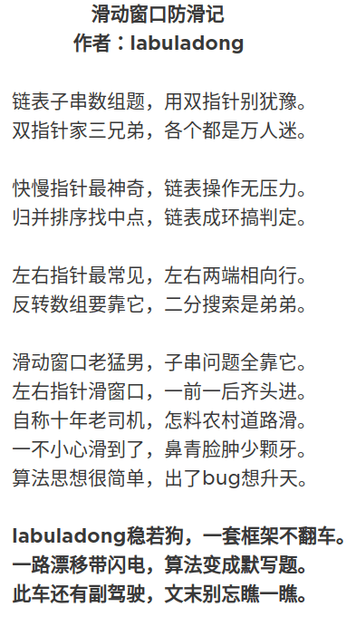

# 滑动窗口算法解题框架

 
 
 ----
 
 本节就注重解决最难掌握的双指针技巧：滑动窗口技巧。  
 这个算法技巧的思路非常简单，就是维护一个窗口，不断滑动，然后更新答案。LeetCode上至少有10道运用滑动窗口算法的题目，难度都是中等和困难，该算法的大致逻辑如下：
 ```java
int left = 0, right = 0;

while (right < s.size()) {
    // 增大窗口
    window.add(s[right]);
    right++;
   
    while (window needs shrink) {
        // 缩小窗口
        window.remove(s[left]);
        left++;
    }
}
```

困难的不是算法的思路，而是各种细节问题。比如:
>如何向窗口中添加新元素，  
>如何缩小窗口，  
>在窗口滑动的哪个阶段更新结果。

总结了一个滑动窗口算法的代码框架：
```java
void slidingWindow(String s, String t) {
     Map<Character, Integer> need, window;
    for (int i = 0; i < t.length(); i++) {
        need.put(t.charAt(i), need.getOrDefault(t.charAt(i), 0) + 1);
    }
    
    int left = 0, right = 0;
    int valid = 0;
    while (right < s.zize()) {
        // c 是将移入窗口的字符
        char c = s.charAt(right);
        // 右移窗口
        right++;
        // 进行窗口内数据的一系列的更新
        。。。
        
        /*** debug 输出的位置 ***/
        System.out.println(left, right);
        /**********************/
        
        // 判断左侧窗口是否需要收缩
        while (window  needs shrink) {
            // d 是将移出窗口的字符
            char d = s.charAt(right);
            // 左移窗口
            left++;
            // 进行窗口内数据的一系列更新
            。。。
        }
    }
}
```
上述代码中，两处 。。。 表示更新窗口数据的地方，到时候你直接往里面填具体逻辑就行了。  
而且，这两处。。。的操作分别是右移和左移窗口的更新操作。

## 1、最小覆盖子串
> 最小覆盖子串   
>给你一个字符串 s 、一个字符串 t 。返回 s 中涵盖 t 所有字符的最小子串。如果 s 中不存在涵盖 t 所有字符的子串，则返回空字符串 "" 。
>
>注意：如果 s 中存在这样的子串，我们保证它是唯一的答案。

```java
    public String minWindow(String s, String t) {
        Map<Character, Integer> need = new HashMap<>(), window = new HashMap<>();

        for (int i = 0; i < t.length(); i++) {
            need.put(t.charAt(i), need.getOrDefault(t.charAt(i), 0) + 1);
        }

        int left = 0, right = 0;
        int valid = 0;

        int start = 0, len = Integer.MAX_VALUE;

        while (right < s.length()) {
            // c 是 移入滑动窗口的字符
            char c = s.charAt(right);

            right++;

            // 进行窗口内的数据更新
            if (need.containsKey(c)) {
                window.put(c, window.getOrDefault(c, 0) + 1);
                if (window.get(c).equals(need.get(c)) ) {
                    valid++;
                }
            }

            // 判断是否全部满足
            while (valid == need.size()) {
                // 更新最小子串
                if (right - left < len) {
                    start = left;
                    len = right - left;
                }

                // d 是移出窗口左侧的字符
                char d = s.charAt(left);
                // 收缩左侧窗口
                left++;
                // 进行窗口内数据的一系列的更新
                if (need.containsKey(d)) {
                    if (window.get(d).equals(need.get(d))) {
                        valid--;
                    }
                    window.put(d, window.get(d) - 1);
                }
            }
        }

        return len == Integer.MAX_VALUE ? "" : s.substring(start, start + len);
    }
```

## 2、字符串的排列
>字符串的排列  
>给定两个字符串 s1 和 s2，写一个函数来判断 s2 是否包含 s1 的排列。
>
> 换句话说，第一个字符串的排列之一是第二个字符串的子串。

注意点：  
1、收缩窗口的时机是窗口大小大于 s1的长度，因为不管 s1 怎么排序，长度是不会变的  
2、vaild == need.size()时，说明窗口中的数组就是一个合法的排列，可以返回true了  
解法如下：
```java
    public boolean checkInclusion(String s1, String s2) {
        Map<Character, Integer> need = new HashMap<>();
        Map<Character, Integer> window = new HashMap<>();

        // 将字符放入need中
        for (int i = 0; i < s1.length(); i++) {
            need.put(s1.charAt(i), need.getOrDefault(s1.charAt(i), 0) + 1);
        }

        int left = 0, right = 0;
        int vaild = 0;

        while (right < s2.length()) {
            char c = s2.charAt(right);
            right++;

            if (need.containsKey(c)) {
                window.put(c, window.getOrDefault(c, 0) + 1);
                if (window.get(c).equals(need.get(c))) {
                    vaild++;
                }
            }

            // 判断是否收缩：收缩窗口的时机是窗口大小大于 s1 的长度，因为不管怎么排列，长度肯定不会变
            while (right - left >= s1.length()) {
                // 在这里判断是否找到合法的子串
                if (vaild == need.size()) {
                    return true;
                }
                char d = s2.charAt(left);
                left++;
                // 更新窗口内的一系列的数据
                if (need.containsKey(d)) {
                    if (window.get(d).equals(need.get(d))) {
                        vaild--;
                    }
                    window.put(d, window.get(d) - 1);
                }
            }
        }
        // 未找到符合条件的子串
        return false;
    }
```

## 3、找所有字母异位词
> 找所有字母异位词  
> 给定一个字符串 s 和一个非空字符串 p，找到 s 中所有是 p 的字母异位词的子串，返回这些子串的起始索引。  
> 字符串只包含小写英文字母，并且字符串 s 和 p 的长度都不超过 20100。  
> 说明：  
> 字母异位词指字母相同，但排列不同的字符串。  
> 不考虑答案输出的顺序。
>

```java
    public List<Integer> findAnagrams(String s, String p) {
        List<Integer> ans = new ArrayList<>();

        Map<Character, Integer> need = new HashMap<>();
        Map<Character, Integer> window = new HashMap<>();
        for (int i = 0; i < p.length(); i++) {
            need.put(p.charAt(i), need.getOrDefault(p.charAt(i), 0) + 1);
        }

        int left = 0, right = 0;
        int vaild = 0;
        while (right < s.length()) {
            // 要从右侧移入窗口的字符
            char c = s.charAt(right);
            right++;

            if (need.containsKey(c)) {
                window.put(c, window.getOrDefault(c, 0) + 1);
                if (need.get(c).equals(window.get(c))) {
                    vaild++;
                }
            }

            while (right - left >= p.length()) {
                // 判断是否找到合适的子串
                if (vaild == need.size()) {
                    // 将索引加到ans结果中
                    ans.add(left);
                }
                // 要从左侧移出窗口的字符
                char d = s.charAt(left);
                left++;
                // 更新窗口内的一系列的数据
                if (need.containsKey(d)) {
                    if (need.get(d).equals(window.get(d))) {
                        vaild--;
                    }
                    window.put(d, window.get(d) - 1);
                }
            }
        }
        return ans;
    }
```

## 4、最长无重复子串
> 最长无重复子串  
> 给定一个字符串，请你找出其中不含有重复字符的 最长子串 的长度。

```java

```
