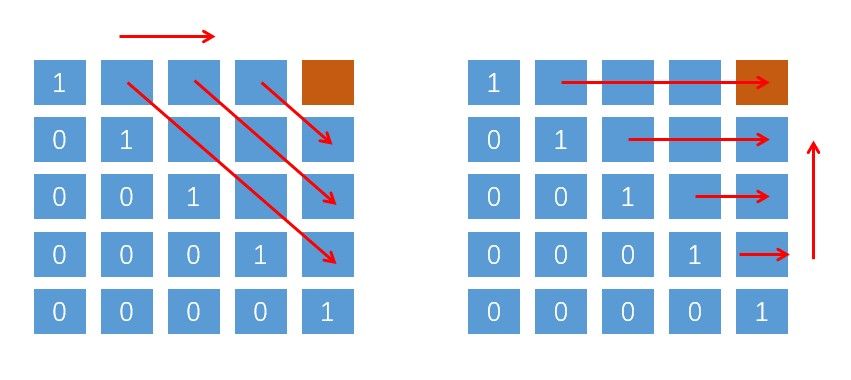

# 子序列问题解题模板：最长回文子序列
子序列问题是常见问题，不容易解决。  
1、子序列问题本身就相对于字符串、子数组更困难，因为子序列是不连续的序列，而后两者是连续的。   
2、子序列问题很可能涉及到两个字符串，比如前文的 最长公共子序列。  

一般来说，这类问题都是求一个最长子序列，一旦涉及子序列和最值，考察的是动态规划技巧，时间复杂度为 O(n * n).  
既然要用动态规划，那就要定义 dp 数组，寻找状态转移关系。   
我们说的两种思路模板，就是 dp 数组的定义思路。不同的问题可能需要不同的 dp 数组定义来解决。   

## 1、两种思路
### 1、第一种思路模板：一个一维的 dp 数组：  
以 “最长递增子序列”为例：   
**dp数组的定义：**   
在子数组 array[0..i] 中，以 array[i] 为结尾的最长递增子序列的长度就是 dp[i]
```java
int n = array.length;
int[] dp = new int[n];

for (int i = 1; i < n; i++) {
    for (int j = 0; j < i; j++) {
        dp[i] = 最值(dp[i], dp[j] + ...);
    }
}
```

### 2、第二种思路模板：一个二维的 dp 数组：
```java
int n = arr.length;
int[][] dp = new int[n][n];

for (int i = 0; i < n; i++) {
    for (int j = 0; j < n; j++) {
        if (arr[i] == arr[j]) {
            dp[i][j] = dp[i][j] + ...
        } else {
            dp[i][j] = 最值（...）
        }
    }
}
```
这种思路运用相对多一些，尤其是涉及到两个字符串 / 数组的子序列，比如前文讲的 “最长公共子序列” 和 “编辑距离”。   
本思路中 dp 数组含义 又 分为 “只涉及到一个字符串” 和 “涉及到两个字符串” 两种情况。  
#### 2a 涉及到两个字符串 / 数组 时 （比如 最长公共子序列）
dp 数组的定义如下：
> 在子数组 arr1[0..i] 和 子数组 arr2[0..i] 中，要求的子序列（最长公共子序列）长度为 dp[i][j]

#### 2b 只涉及一个字符串 / 数组 时 （比如 最长回文子序列）
dp 数组的定义如下：
> 在子数组 arr[i..j] 中，要求的子序列（最长回文子序列）的长度为 dp[i][j]

## 2、最长回文子序列
> 给定一个字符串 s ，找到其中最长的回文子序列，并返回该序列的长度。可以假设 s 的最大长度为 1000 。

dp 数组的定义：
> 在子串 s[i..j] 中，最长回文子序列的长度为 dp[i][j]  

想求 dp[i][j]，假设知道了子问题 dp[i + 1][j - 1]的结果（s[i+1..j-1] 中最长回文子序列的长度），是否能想办法算出 dp[i][j] 的值（s[i..j] 中最长回文子序列的长度）呢？   
这个取决于 s[i] 和 s[j] 的字符：   
（1） 如果 两个字符相等，那么加上 s[i+1..j-1] 中的最长回文子序列就是 s[i..j]的最长回文子序列：  
> dp[i][j] = dp[i + 1][j - 1] + 2;

(2) 如果 两个字符不相等，那么说明他俩不可鞥同时出现在 s[i..j] 的最长回文子序列中，那么，把它们分别加入 s[i+1..j-1]中，看看哪个子串产生的回文子序列更长即可：
> dp[i][j] = Math.max(dp[i + 1][j], dp[i][j - 1]);

那么状态转移方程的代码：
```java
if (s[i] == s[j]) {
    // 它俩一定在最长回文子序列中
    dp[i][j] = dp[i + 1][j - 1] + 2;
} else {
    // 比较一下 s[i+1..j] 和 s[i..j-1] 谁的回文子序列更长？
    dp[i][j] = Math.max(dp[i][j - 1], dp[i + 1][j]);
}
```
状态转移方程写出来了，根据 dp 数组的定义，我们要求的就是 dp[0][n - 1], 也就是整个 s 的最长回文子序列的长度。

## 3、代码实现
1、首先是关于 base case的情况，如果只有一个字符，显然 最长回文子序列长度是 1 ，
> dp[i][j] = 1 (i == j)
> 因为 i 肯定小于等于 j，所以对于那些 i > j 的位置，根本不存在什么子序列，应该初始化为 0.

2、另外，刚才写的状态转移方程，想求 dp[i][j] 需要知道 dp[i + 1][j - 1], dp[i + 1][j] 和 dp[i][j - 1] 这三个位置；  
再看看我们确定的基本情况，填入 dp 数组之后是这样的：

为了保证每次计算 dp[i][j]，左下右方向的位置已经被计算出来，只能斜着遍历或者反着遍历：   
 

选择反着遍历，代码如下：
```java
class Solution {
    public int longestPalindromeSubseq(String s) {
        if (s.length() == 1) {
            return 1;
        }
        int len = s.length();
        // dp 数组定义： dp[i][j] 表示 s[i..j]中最大回文子序列
        int[][] dp = new int[len][len];

        // base case
        for (int i = 0; i < len; i++) {
            for (int j = 0; j <= i; j++) {
                if (i > j) {
                    dp[i][j] = 0;
                } else {
                    // s[i..i] 表示只有一个字符
                    dp[i][j] = 1;
                }
            }
        }

        for (int i = len - 2; i >= 0; i--) {
            for (int j = i + 1; j < len; j++) {
                if (s.charAt(i) == s.charAt(j)) {
                    dp[i][j] = dp[i + 1][j - 1] + 2;
                } else {
                    dp[i][j] = Math.max(dp[i][j - 1], dp[i + 1][j]);
                }
            }
        }
        // 整个 s 的最大回文子序列长度
        return dp[0][len - 1];
    }
}
```

选择斜向遍历，代码如下：
```java
class Solution {
    public int longestPalindromeSubseq(String s) {
        if (s.length() == 1) {
            return 1;
        }
        int len = s.length();
        // dp 数组定义： dp[i][j] 表示 s[i..j]中最大回文子序列
        int[][] dp = new int[len][len];

        // base case
        for (int i = 0; i < len; i++) {
            for (int j = 0; j <= i; j++) {
                if (i > j) {
                    dp[i][j] = 0;
                } else {
                    // s[i..i] 表示只有一个字符
                    dp[i][j] = 1;
                }
            }
        }

        // 变量 l 用来辅助斜向遍历
        for (int l = 2; l <= len; l++) {
            for (int i = 0; i <= len - l; i++) {
                int j = l + i - 1;
                if (s.charAt(i) == s.charAt(j)) {
                    dp[i][j] = dp[i + 1][j - 1] + 2;
                } else {
                    dp[i][j] = Math.max(dp[i][j - 1], dp[i + 1][j]);
                }
            }
        }
        // 整个 s 的最大回文子序列长度
        return dp[0][len - 1];
    }
}
```
至此，最长回文子序列的问题就解决了。

