# Kafka面试专题

> 1、什么是消息中间件
> 2、kafka 是什么？ 有什么作用？
> 3、kafka 的架构是怎么样的？
> 4、kafka Replicas 是怎么管理的？
> 5、如何确定当前能读到哪一条消息？
> 6、生产者发送消息有哪些模式？
> 7、发送消息的分区策略有哪些？
> 8、kafka 支持读写分离吗？ 为什么？
> 9、那 kafka 是怎么去实现负载均衡的？
> 10、kafka 的负载均衡会有什么问题呢？
> 11、kafka 的可靠性是怎么保证的？
> 12、kafka 的消息消费方式有哪些？
> 13、分区再分配是做什么的？解决了什么问题？
> 14、副本 leader 是怎么选举的？
> 15、分区数越多越好吗？吞吐量就会越高吗？
> 16、如何增强消费者的消费能力？
> 17、消费者与topic的分区分配策略有哪些？
> 18、kafka 控制器是什么？有什么作用？
> 19、kafka 控制器是怎么进行选举的？
> 20、kafka 为什么这么快？
> 21、什么情况下，kafka会丢失消息？

## 
1、什么是消息中间件

消息中间件是基于队列与消息传递技术，在网络环境中为应用系统提供同步或异步、可靠的消息传输的支撑性软件系统。

消息中间件利用高效可靠的消息传递机制进行平台无关的数据交流，并基于数据通信来进行分布式系统的集成。通过提供消息传递和消息排队模型，它可以在分布式环境下扩展进程间的通信。

## 
2、kafka 是什么？ 有什么作用？

Kafka 是一个分布式的流式处理平台，它以高吞吐、可持久化、可水平扩展、支持流数据处理等多种特性而被广泛使用。
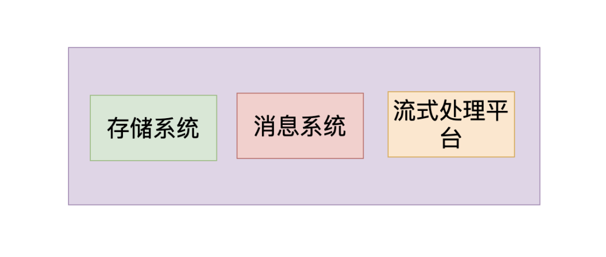

主要功能体现于三点：
> 消息系统：kafka与传统的消息中间件都具备系统解耦、冗余存储、流量削峰、缓冲、异步通信、扩展性、可恢复性等功能。与此同时，kafka还提供了大多数消息系统难以实现的消息顺序性保障及回溯性消费的功能。
> 存储系统：kafka把消息持久化到磁盘，相比于其他基于内存存储的系统而言，有效的降低了消息丢失的风险。这得益于其消息持久化和多副本机制。也可以将kafka作为长期的存储系统来使用，只需要把对应的数据保留策略设置为“永久”或启用主题日志压缩功能。
> 流式处理平台：kafka为流行的流式处理框架提供了可靠的数据来源，还提供了一个完整的流式处理框架，比如窗口、连接、变换和聚合等各类操作。

## 
3、kafka 的架构是怎么样的？

一个典型的 kafka 体系架构包括若干 Producer、若干 Consumer、以及一个 Zookeeper 集群（在2.8.0版本中移，除了 Zookeeper,通过 KRaft 进行自己的集群管理）

Producer 将消息发送到 Broker，Broker 负责将受到的消息存储到磁盘中，而 Consumer 负责从 Broker 订阅并消费消息。

Kafka 基本概念：
> Producer ：生产者，负责将消息发送到 Broker
> Consumer ：消费者，从 Broker 接收消息
> Consumer Group ：消费者组，由多个 Consumer 组成。消费者组内每个消费者负责消费不同分区的数据，一个分区只能由一个组内消费者消费；消费者组之间互不影响。所有的消费者都属于某个消费者组，即消费者组是逻辑上的一个订阅者。
> Broker ：可以看做一个独立的 Kafka 服务节点或 Kafka 服务实例。如果一台服务器上只部署了一个 Kafka 实例，那么我们也可以将 Broker 看做一台 Kafka 服务器。
> Topic ：一个逻辑上的概念，包含很多 Partition，同一个 Topic 下的 Partiton 的消息内容是不相同的。
> Partition ：为了实现扩展性，一个非常大的 topic 可以分布到多个 broker 上，一个 topic 可以分为多个 partition，每个 partition 是一个有序的队列。
> Replica ：副本，同一分区的不同副本保存的是相同的消息，为保证集群中的某个节点发生故障时，该节点上的 partition 数据不丢失，且 kafka 仍然能够继续工作，kafka 提供了副本机制，一个 topic 的每个分区都有若干个副本，一个 leader 和若干个 follower。
> Leader ：每个分区的多个副本中的"主副本"，生产者以及消费者只与 Leader 交互。
> Follower ：每个分区的多个副本中的"从副本"，负责实时从 Leader 中同步数据，保持和 Leader 数据的同步。Leader 发生故障时，从 Follower 副本中重新选举新的 Leader 副本对外提供服务。

## 
4、kafka Replicas 是怎么管理的？

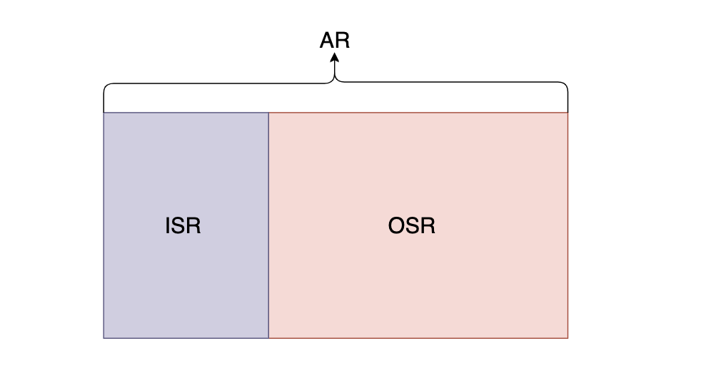

> AR:分区中的所有 Replica 统称为 AR
> ISR:所有与 Leader 副本保持一定程度同步的Replica(包括 Leader 副本在内)组成 ISR
> OSR:与 Leader 副本同步滞后过多的 Replica 组成了 OSR

Leader 负责维护和跟踪 ISR 集合中所有 Follower 副本的滞后状态，当 Follower 副本落后过多时，就会将其放入 OSR 集合，当 Follower 副本追上了 Leader 的进度时，就会将其放入 ISR 集合。

默认情况下，只有 ISR 中的副本才有资格晋升为 Leader。

## 
5、如何确定当前能读到哪一条消息？

分区相当于一个日志文件，我们先简单介绍几个概念

如上图是一个分区日志文件

- 标识共有7条消息，offset (消息偏移量)分别是0~6
- 0 代表这个日志文件的开始
- HW(High Watermark) 为4，0~3 代表这个日志文件可以消费的区间，消费者只能消费到这四条消息
- LEO 代表即将要写入消息的偏移量 offset

分区 ISR 集合中的每个副本都会维护自己的 LEO，而 ISR 集合中最小的LEO 即为分区的 HW

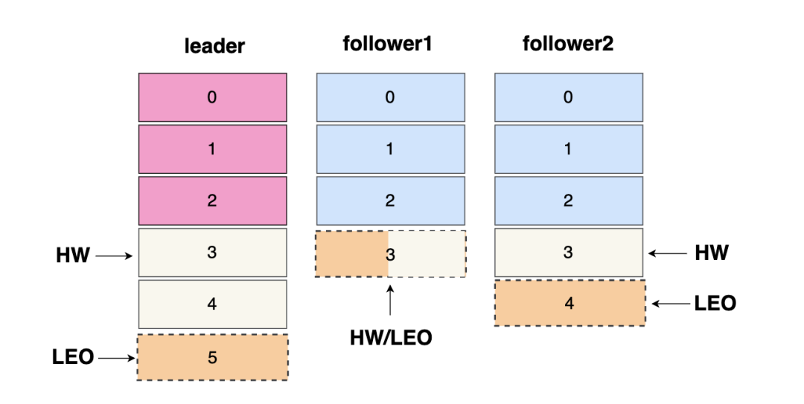

如上图: 三个分区副本都是 ISR集合当中的，最小的 LEO 为 3，就代表分区的 HW 为3，所以当前分区只能消费到 0~2 之间的三条数据，如下图：

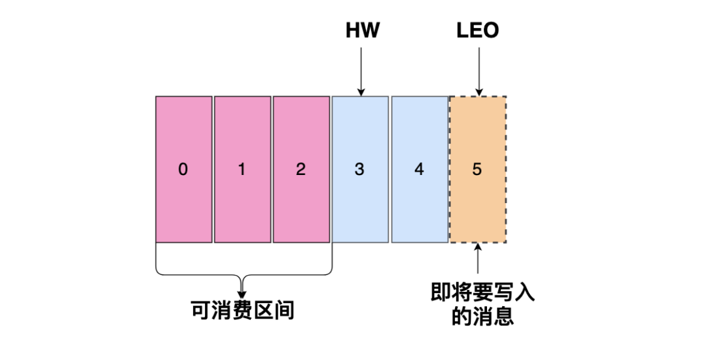

## 
6、生产者发送消息有哪些模式？

总共有三种模式
- 1.发后即忘（fire-and-forget）
> 它只管往 Kafka 里面发送消息，但是不关心消息是否正确到达，这种方式的效率最高，但是可靠性也最差，比如当发生某些不可充实异常的时候会造成消息的丢失
- 2.同步（sync）
> producer.send()返回一个Future对象，调用get()方法变回进行同步等待，就知道消息是否发送成功，发送一条消息需要等上个消息发送成功后才可以继续发送
- 3.异步（async）
> Kafka支持 producer.send() 传入一个回调函数，消息不管成功或者失败都会调用这个回调函数，这样就算是异步发送，我们也知道消息的发送情况，然后再回调函数中选择记录日志还是重试都取决于调用方

## 
7、发送消息的分区策略有哪些？

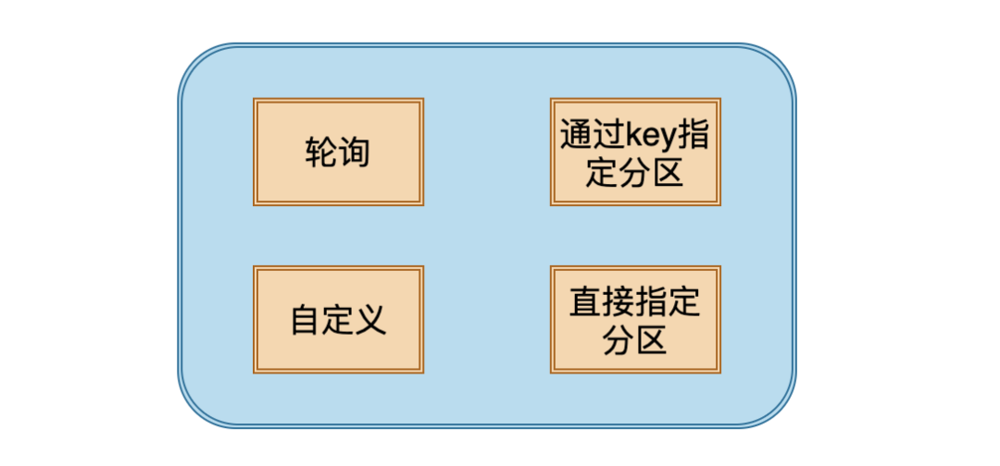

- 1.轮询：依次将消息发送该topic下的所有分区，如果在创建消息的时候 key 为 null，Kafka 默认采用这种策略。
- 2.key 指定分区：在创建消息是 key 不为空，并且使用默认分区器，Kafka 会将 key 进行 hash，然后根据hash值映射到指定的分区上。这样的好处是 key 相同的消息会在一个分区下，Kafka 并不能保证全局有序，但是在每个分区下的消息是有序的，按照顺序存储，按照顺序消费。在保证同一个 key 的消息是有序的，这样基本能满足消息的顺序性的需求。但是如果 partation 数量发生变化，那就很难保证 key 与分区之间的映射关系了。
- 3.自定义策略：实现 Partitioner 接口就能自定义分区策略。
- 4.指定 Partiton 发送

## 
8、kafka 支持读写分离吗？为什么？

Kafka 是不支持读写分离的，那么读写分离的好处是什么？主要就是让一个节点去承担另一个节点的负载压力，也就是能做到一定程度的负载均衡，而且 Kafka 不通过读写分离也可以一定程度上去实现负载均衡。

但是对于 Kafka 的架构来说，读写分离有两个很大的缺点
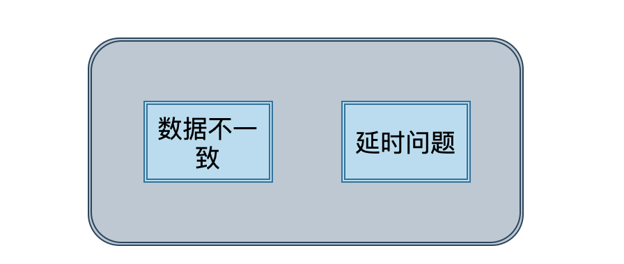

- 1.数据不一致的问题:读写分离必然涉及到数据的同步，只要是不同节点之间的数据同步，必然会有数据不一致的问题存在。
- 2.延时问题:由于 Kafka 独特的数据处理方式，导致如果将数据从一个节点同步到另一个节点必然会经过主节点磁盘和从节点磁盘，对一些延时性要求较高的应用来说，并不太适用

## 
9、那 Kafka 是怎么去实现负载均衡的？

Kafka 的负责均衡主要是通过分区来实现的，我们知道 Kafka 是主写主读的架构，如下图:

共三个 broker ，里面各有三个副本，总共有三个 partation， 深色的是 leader，浅色的是 follower，上下灰色分别代表生产者和消费者，虚线代表 follower 从 leader 拉取消息。

我们从这张图就可以很明显的看出来，每个 broker 都有消费者拉取消息，每个 broker 也都有生产者发送消息，每个 broker 上的读写负载都是一样的，这也说明了 kafka 独特的架构方式可以通过主写主读来实现负载均衡。

## 
10、Kafka 的负载均衡会有什么问题呢？

kafka的负载均衡在绝对理想的状况下可以实现，但是会有某些情况出现一定程度上的负载不均衡

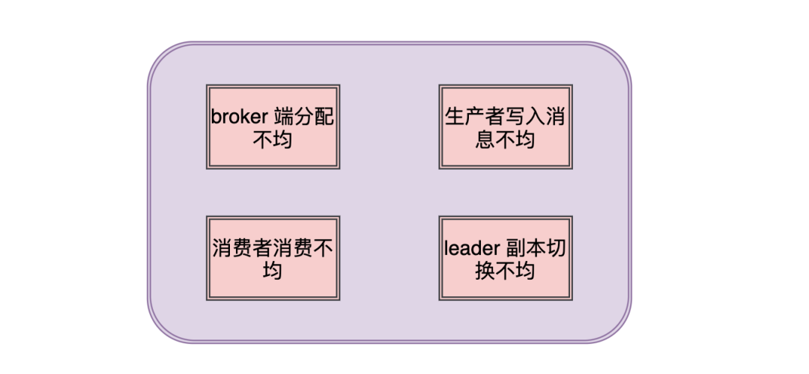

- 1.broker 端分配不均:当创建 topic 的时候可能会出现某些 broker 分配到的分区数多，而有些 broker 分配的分区少，这就导致了 leader 多副本不均。
- 2.生产者写入消息不均:生产者可能只对某些 broker 中的 leader 副本进行大量的写入操作，而对其他的 leader 副本不闻不问。
- 3.消费者消费不均:消费者可能只对某些 broker 中的 leader 副本进行大量的拉取操作，而对其他的 leader 副本不闻不问。
- 4.leader 副本切换不均：当主从副本切换或者分区副本进行了重分配后，可能会导致各个 broker 中的 leader 副本分配不均匀。

## 
11、Kafka 的可靠性是怎么保证的？

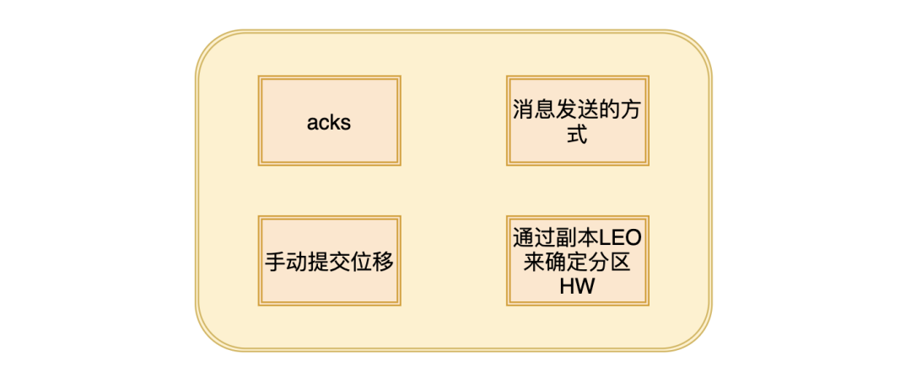

### 1.acks

这个参数用来指定分区中有多少个副本收到这条消息，生产者才认为这条消息是写入成功的，这个参数有三个值：

- 1.acks = 1，默认为1。生产者发送消息，只要 leader 副本成功写入消息，就代表成功。这种方案的问题在于，当返回成功后，如果 leader 副本和 follower 副本还没有来得及同步，leader 就崩溃了，那么在选举后新的 leader 就没有这条消息，也就丢失了。
- 2.acks = 0。生产者发送消息后直接算写入成功，不需要等待响应。这个方案的问题很明显，只要服务端写消息时出现任何问题，都会导致消息丢失。
- 3.acks = -1 或 acks = all。生产者发送消息后，需要等待 ISR 中的所有副本都成功写入消息后才能收到服务端的响应。毫无疑问这种方案的可靠性是最高的，但是如果 ISR 中只有leader 副本，那么就和 acks = 1 毫无差别了。
### 2.消息发送的方式

第6问中我们提到了生产者发送消息有三种方式，发完即忘，同步和异步。我们可以通过同步或者异步获取响应结果，失败做重试来保证消息的可靠性。

### 3.手动提交位移

默认情况下，当消费者消费到消息后，就会自动提交位移。但是如果消费者消费出错，没有进入真正的业务处理，那么就可能会导致这条消息消费失败，从而丢失。我们可以开启手动提交位移，等待业务正常处理完成后，再提交offset。

### 4.通过副本 LEO 来确定分区 HW

可参考第五问

## 
12、Kafka 的消息消费方式有哪些？

一般消息消费有两种模式，推和拉。Kafka的消费是属于拉模式的，而此模式的消息消费方式有两种，点对点和发布订阅。

- 1.点对点:如果所有消费者属于同一个消费组，那么所有的消息都会被均匀的投递给每一个消费者，每条消息只会被其中一个消费者消费。
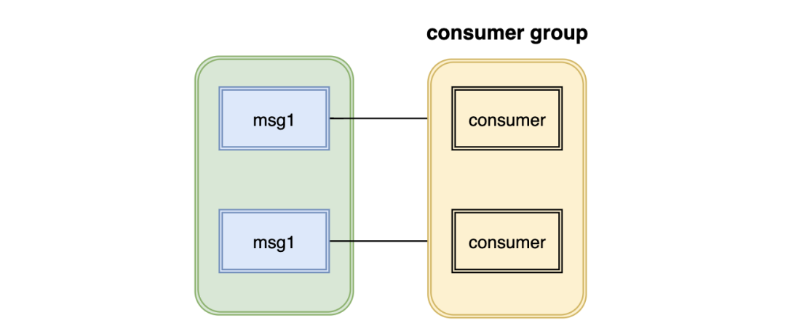

- 2.发布订阅:如果所有消费者属于不同的消费组，那么所有的消息都会被投递给每一个消费者，每个消费者都会收到该消息。
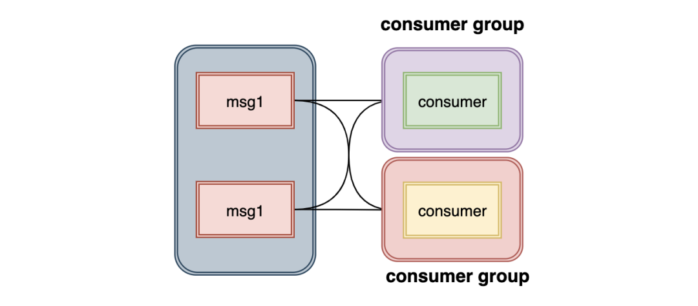

## 
13、分区再分配是做什么的？解决了什么问题？

分区再分配主要是用来维护 kafka 集群的负载均衡

既然是分区再分配，那么 kafka 分区有什么问题呢？

- 问题1:当集群中的一个节点下线了
    -  如果该节点的分区是单副本的,那么分区将会变得不可用
    - 如果是多副本的，就会进行 leader 选举，在其他机器上选举出新的 leader

kafka 并不会将这些失效的分区迁移到其他可用的 broker 上，这样就会影响集群的负载均衡，甚至也会影响服务的可靠性和可用性

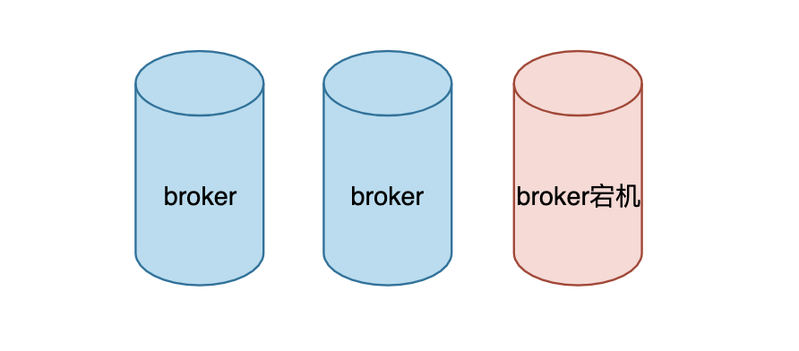

- 问题2:当集群新增 broker 时，只有新的主题分区会分配在该 broker 上，而老的主题分区不会分配在该 broker 上，就造成了老节点和新节点之间的负载不均衡。
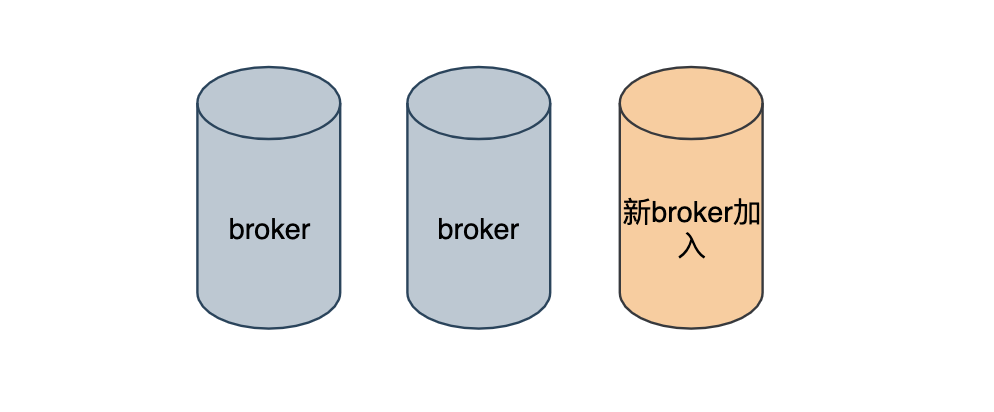

为了解决该问题就出现了分区再分配，它可以在集群扩容，broker 失效的场景下进行分区迁移。

分区再分配的原理就是通化控制器给分区新增新的副本，然后通过网络把旧的副本数据复制到新的副本上，在复制完成后，将旧副本清除。 当然，为了不影响集群正常的性能，在此复制期间还会有一些列保证性能的操作，比如复制限流。

## 
14、副本 leader 是怎么选举的？

当分区 leader 节点崩溃时，其中一个 follower 节点会成为新的 leader 节点，这样会导致集群的负载不均衡，从而影响服务的健壮性和稳定性。

如下:
> Topic: test Partation:0 Leader:1 Replicas:1,2,0 Isr:1,2,0
> Topic: test Partation:1 Leader:2 Replicas:2,0,1 Isr:2,0,1
> Topic: test Partation:2 Leader:0 Replicas:0,1,2 Isr:0,1,2

我们可以看到

- 0 分区有 1 个 leader
- 1 分区有 2 个 leader
- 2 分区有 0 个 leader

如果此时中间的节点重启

> Topic: test Partation:0 Leader:1 Replicas:1,2,0 Isr:1,0,2
> Topic: test Partation:1 Leader:0 Replicas:2,0,1 Isr:0,1,2
> Topic: test Partation:2 Leader:0 Replicas:0,1,2 Isr:0,1,2

我们又可以看到:

- 0 分区有 1 个 leader
- 1 分区有 0 个 leader
- 2 分区有 0 个 leader

我们会发现，原本 1 分区有两个 ledaer，经过重启后 leader 都消失了，如此就负载不均衡了。

为了解决这种问题，就引入了优先副本的概念

优先副本就是说在 AR 集合中的第一个副本。比如分区 2 的 AR 为 0，1，2，那么分区 2 的优先副本就为0。理想情况下优先副本就是 leader 副本。优先副本选举就是促使优先副本成为 leader 副本，从而维护集群的负载均衡。

## 
15、分区数越多越好吗？吞吐量就会越高吗？

一般类似于这种问题的答案，都是持否定态度的。

但是可以说，在一定条件下，分区数的数量是和吞吐量成正比的，分区数和性能也是成正比的。

那么为什么说超过了一定限度，就会对性能造成影响呢？原因如下:

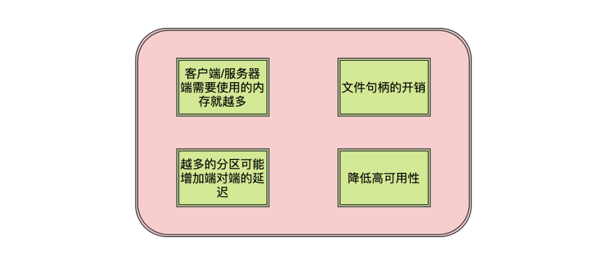

### 1.客户端/服务器端需要使用的内存就越多

服务端在很多组件中都维护了分区级别的缓存，分区数越大，缓存成本也就越大。
消费端的消费线程数是和分区数挂钩的，分区数越大消费线程数也就越多，线程的开销成本也就越大
生产者发送消息有缓存的概念，会为每个分区缓存消息，当积累到一定程度或者时间时会将消息发送到分区，分区越多，这部分的缓存也就越大

### 2.文件句柄的开销

每个 partition 都会对应磁盘文件系统的一个目录。在 Kafka 的数据日志文件目录中，每个日志数据段都会分配两个文件，一个索引文件和一个数据文件。每个 broker 会为每个日志段文件打开一个 index 文件句柄和一个数据文件句柄。因此，随着 partition 的增多，所需要保持打开状态的文件句柄数也就越多，最终可能超过底层操作系统配置的文件句柄数量限制。

### 3.越多的分区可能增加端对端的延迟

Kafka 会将分区 HW 之前的消息暴露给消费者。分区越多则副本之间的同步数量就越多，在默认情况下，每个 broker 从其他 broker 节点进行数据副本复制时，该 broker 节点只会为此工作分配一个线程，该线程需要完成该 broker 所有 partition 数据的复制。

### 4.降低高可用性

在第 13 问我们提到了分区再分配，会将数据复制到另一份副本当中，分区数量越多，那么恢复时间也就越长，而如果发生宕机的 broker 恰好是 controller 节点时：在这种情况下，新 leader 节点的选举过程在 controller 节点恢复到新的 broker 之前不会启动。controller 节点的错误恢复将会自动地进行，但是新的 controller 节点需要从 zookeeper 中读取每一个 partition 的元数据信息用于初始化数据。例如，假设一个Kafka 集群存在 10000个partition，从 zookeeper 中恢复元数据时每个 partition 大约花费 2 ms，则 controller 的恢复将会增加约 20 秒的不可用时间窗口。

## 
16、如何增强消费者的消费能力？

- 1.可以考虑增加 topic 的分区数，并且同时提升消费组的消费者数量，消费者数=分区数。
- 2.如果是消费者消费不及时，可以采用多线程的方式进行消费，并且优化业务方法流程，同样的分区数，为什么人家并发那么高，你的就不行？？

## 
17、消费者与 topic 的分区分配策略有哪些？

### 1.RangeAssignor 分配策略

该分配策略是按照消费者总数和分区总数进行整除运算来获得一个跨度，然后分区按照跨度来进行平均分配，尽可能保证分区均匀的分配给所有的消费者。

对于每个 topic，该策略会讲消费者组内所有订阅这个主题的消费者按照名称的字典顺序排序，然后为每个消费者划分固定过的区域，如果不够平均分配，那么字典排序考前的就会多分配一个分区。

比如 2 个消费者属于一个消费者组，有 2 个 topic t1，t2，每个 topic 都有 3 个分区，p1，p2，p3，那么分配的情况如下:
> 消费者A:t0-p0，t0-p1，t1-p0，t1-p1，
> 消费者B:t0-p2，t1-p2

这样就会出现非配不均匀的情况

### 2.RoundRobinAssignor 分配策略

该分配策略是按将消费者组内所有消费者及消费者订阅的所有主题的分区按照字典排序，然后通过轮询的方式分配给每个消费者。

比如有 3 个消费者 A，B，C，订阅了 3 个 topic ，t0，t1，t2，每个 topic 各有 3 个分区 p0，p1，p2。如果 A 订阅了 t0，B 订阅了 t0 和 t1，C 订阅了 t0，t1，t2，那么分配的情况如下:

> 消费者A:t0-p0
> 消费者B:t1-p0
> 消费者C:t1-p1，t2-p0，t2-p1，t2-p2

这样也会出现分配不均匀的情况，按照订阅情况来讲完全可以吧 t1p1 分配给消费者B

### 3.StickyAssignor分配策略

这种分配策略有两个目的

- 1.分区的分配要尽可能的均匀
- 2.分区的分配尽可能的与上次分配的保持相同。

当两者发生冲突时，第一个目标优先于第二个目标。

假设消费组内有3个消费者：C0、C1、C2
它们都订阅了4个主题：t0、t1、t2、t3
并且每个主题有2个分区，也就是说整个消费组订阅了，t0p0、t0p1、t1p0、t1p1、t2p0、t2p1、t3p0、t3p1 这8个分区
最终的分配结果如下：

> 消费者C0：t0p0、t1p1、t3p0
> 消费者C1：t0p1、t2p0、t3p1
> 消费者C2：t1p0、t2p1

这样初看上去似乎与采用RoundRobinAssignor策略所分配的结果相同

此时假设消费者C1脱离了消费组，那么消费组就会执行再平衡操作，进而消费分区会重新分配。如果采用RoundRobinAssignor策略，那么此时的分配结果如下：

> 消费者C0：t0p0、t1p0、t2p0、t3p0
> 消费者C2：t0p1、t1p1、t2p1、t3p1

如分配结果所示，RoundRobinAssignor策略会按照消费者C0和C2进行重新轮询分配。而如果此时使用的是StickyAssignor策略，那么分配结果为：

> 消费者C0：t0p0、t1p1、t3p0、t2p0
> 消费者C2：t1p0、t2p1、t0p1、t3p1

可以看到分配结果中保留了上一次分配中对于消费者C0和C2的所有分配结果，并将原来消费者C1的“负担”分配给了剩余的两个消费者C0和C2，最终C0和C2的分配还保持了均衡。

如果发生分区重分配，那么对于同一个分区而言有可能之前的消费者和新指派的消费者不是同一个，对于之前消费者进行到一半的处理还要在新指派的消费者中再次复现一遍，这显然很浪费系统资源。StickyAssignor策略如同其名称中的“sticky”一样，让分配策略具备一定的“粘性”，尽可能地让前后两次分配相同，进而减少系统资源的损耗以及其它异常情况的发生。

到目前为止所分析的都是消费者的订阅信息都是相同的情况，我们来看一下订阅信息不同的情况下的处理。

举例：同样消费组内有3个消费者：C0、C1、C2
集群中有3个主题 t0、t1、t2
这3个主题分别有 1、2、3个分区
也就是说集群中有 t0p0、t1p0、t1p1、t2p0、t2p1、t2p2 这6个分区
消费者C0订阅了主题t0，消费者C1订阅了主题t0和t1，消费者C2订阅了主题t0、t1和t2
如果此时采用RoundRobinAssignor策略：

> 消费者C0：t0p0
> 消费者C1：t1p0
> 消费者C2：t1p1、t2p0、t2p1、t2p2

如果此时采用的是StickyAssignor策略：
> 消费者C0：t0p0
> 消费者C1：t1p0、t1p1
> 消费者C2：t2p0、t2p1、t2p2

此时消费者C0脱离了消费组，那么RoundRobinAssignor策略的分配结果为：

> 消费者C1：t0p0、t1p1
> 消费者C2：t1p0、t2p0、t2p1、t2p2

StickyAssignor策略，那么分配结果为：

> 消费者C1：t1p0、t1p1、t0p0
> 消费者C2：t2p0、t2p1、t2p2

可以看到StickyAssignor策略保留了消费者C1和C2中原有的5个分区的分配：
> t1p0、t1p1、t2p0、t2p1、t2p2。

从结果上看StickyAssignor策略比另外两者分配策略而言显得更加的优异，这个策略的代码实现也是异常复杂。

### 4.自定义分区分配策略

可以通过实现 org.apache.kafka.clients.consumer.internals.PartitionAssignor 接口来实现

## 
18、kafka控制器是什么？有什么作用？

在 Kafka 集群中会有一个或多个 broker，其中有一个 broker 会被选举为控制器，它负责管理整个集群中所有分区和副本的状态，kafka 集群中只能有一个控制器。

- 当某个分区的 leader 副本出现故障时，由控制器负责为该分区选举新的 leader 副本。
- 当检测到某个分区的ISR集合发生变化时，由控制器负责通知所有 broker 更新其元数据信息。
- 当为某个 topic 增加分区数量时，由控制器负责分区的重新分配。

## 
19、kafka 控制器是怎么进行选举的？

kafka 中的控制器选举工作依赖于 Zookeeper，成功竞选成为控制器的 broker 会在Zookeeper中创建/controller临时节点。

每个 broker 启动的时候会去尝试读取/controller 节点的 brokerid的值

- 如果读取到的 brokerid 的值不为-1，表示已经有其他broker 节点成功竞选为控制器，所以当前 broker 就会放弃竞选；
如果Zookeeper中不存在/controller 节点，或者这个节点的数据异常，那么就会尝试去创建/controller 节点，创建成功的那个 broker 就会成为控制器。

每个 broker 都会在内存中保存当前控制器的 brokerid 值，这个值可以标识为 activeControllerId。

Zookeeper 中还有一个与控制器有关的/controller_epoch 节点，这个节点是持久节点，节点中存放的是一个整型的 controller_epoch 值。controller_epoch 值用于记录控制器发生变更的次数。

controller_epoch 的初始值为1，即集群中的第一个控制器的纪元为1，当控制器发生变更时，每选出一个新的控制器就将该字段值加1。

每个和控制器交互的请求都会携带 controller_epoch 这个字段，

- 如果请求的 controller_epoch 值小于内存中的 controller_epoch值，则认为这个请求是向已经过期的控制器发送的请求，那么这个请求会被认定为无效的请求。
- 如果请求的 controller_epoch 值大于内存中的 controller_epoch值，那么说明已经有新的控制器当选了

## 
20、kafka 为什么这么快？

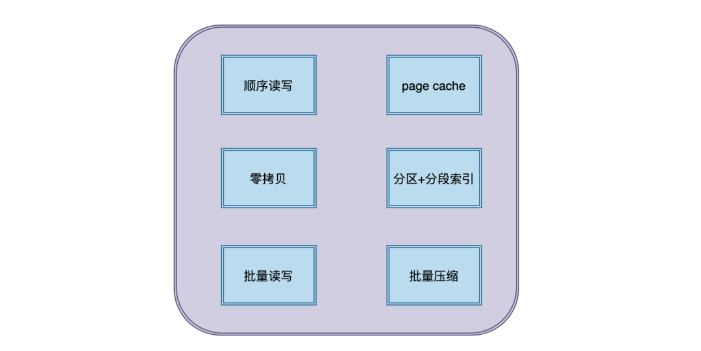

- 1.顺序读写

磁盘分为顺序读写与随机读写，基于磁盘的随机读写确实很慢，但磁盘的顺序读写性能却很高，kafka 这里采用的就是顺序读写。

- 2.Page Cache

为了优化读写性能，Kafka 利用了操作系统本身的 Page Cache，就是利用操作系统自身的内存而不是JVM空间内存。

- 3.零拷贝

Kafka使用了零拷贝技术，也就是直接将数据从内核空间的读缓冲区直接拷贝到内核空间的 socket 缓冲区，然后再写入到 NIC 缓冲区，避免了在内核空间和用户空间之间穿梭。

- 4.分区分段+索引

Kafka 的 message 是按 topic分 类存储的，topic 中的数据又是按照一个一个的 partition 即分区存储到不同 broker 节点。每个 partition 对应了操作系统上的一个文件夹，partition 实际上又是按照segment分段存储的。

通过这种分区分段的设计，Kafka 的 message 消息实际上是分布式存储在一个一个小的 segment 中的，每次文件操作也是直接操作的 segment。为了进一步的查询优化，Kafka 又默认为分段后的数据文件建立了索引文件，就是文件系统上的.index文件。这种分区分段+索引的设计，不仅提升了数据读取的效率，同时也提高了数据操作的并行度。

- 5.批量读写

Kafka 数据读写也是批量的而不是单条的,这样可以避免在网络上频繁传输单个消息带来的延迟和带宽开销。假设网络带宽为10MB/S，一次性传输10MB的消息比传输1KB的消息10000万次显然要快得多。

- 6.批量压缩

Kafka 把所有的消息都变成一个批量的文件，并且进行合理的批量压缩，减少网络 IO 损耗，通过 mmap 提高 I/O 速度，写入数据的时候由于单个Partion是末尾添加所以速度最优；读取数据的时候配合 sendfile 进行直接读取。

## 
21、什么情况下，kafka会丢失消息？

Kafka 有三次消息传递的过程：生产者发消息给 Broker，Broker 同步消息和持久化消息，Broker 将消息传递给消费者。

这其中每一步都有可能丢失消息.

- 1.生产者发送数据: 在第 11 问中的 acks中有说到

    - 当 acks 为 0，只要服务端写消息时出现任何问题，都会导致消息丢失。
    - 当 acks 配置为 1 时，生产者发送消息，只要 leader 副本成功写入消息，就代表成功。这种方案的问题在于，当返回成功后，如果 leader 副本和 follower 副本还没有来得及同步，leader 就崩溃了，那么在选举后新的 leader 就没有这条消息，也就丢失了。
- 2.Broker 存储数据:kafka 通过 Page Cache 将数据写入磁盘。

    - Page Cache 就是当往磁盘文件写入的时候，系统会先将数据流写入缓存中，但是什么时候将缓存的数据写入文件中是由操作系统自行决定。所以如果此时机器突然挂了，也是会丢失消息的。
- 3.消费者消费数据:在开启自动提交 offset 时，只要消费者消费到消息，那么就会自动提交偏移量，如果业务还没有来得及处理，那么消息就会丢失。

> 作者： moon聊技术
> 链接：https://mp.weixin.qq.com/s/xUG9c3FC39DJlJqeXcEDKg
> 来源：微信公众号（moon聊技术）
> 著作权归作者所有。商业转载请联系作者获得授权，非商业转载请注明出处。