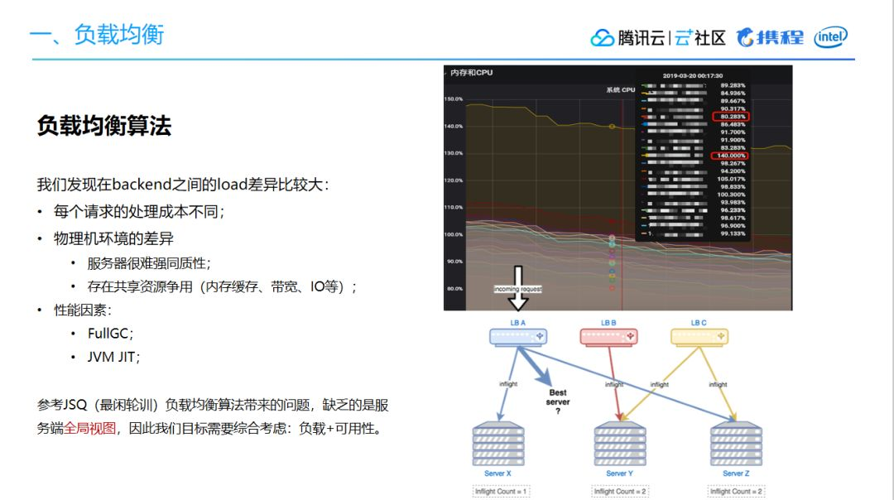
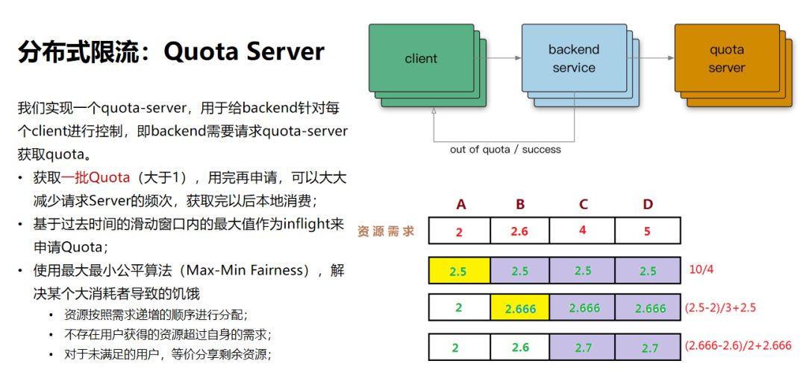
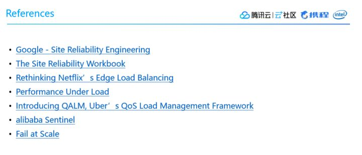

# bilibili技术总监毛剑：B站高可用架构实践

> 流量洪峰下要做好高服务质量的架构是一件具备挑战的事情，本文是B站技术总监毛剑老师在「云加社区沙龙online」的分享整理，详细阐述了从Google SRE的系统方法论以及实际业务的应对过程中出发，一些体系化的可用性设计。对我们了解系统的全貌、上下游的联防有更进一步的帮助。

## 一、负载均衡
负载均衡具体分成两个方向，一个是前端负载均衡，另一个是数据中心内部的负载均衡。

前端负载均衡方面，一般而言用户流量访问层面主要依据DNS，希望做到最小化用户请求延迟。将用户流量最优地分布在多个网络链路上、多个数据中心、多台服务器上，通过动态CDN的方案达到最小延迟。

以上图为例，用户流量会先流入BFE的前端接入层，第一层的BFE实际上起到一个路由的作用，尽可能选择跟接入节点比较近的一个机房，用来加速用户请求。然后通过API网关转发到下游的服务层，可能是内部的一些微服务或者业务的聚合层等，最终构成一个完整的流量模式。基于此，前端服务器的负载均衡主要考虑几个逻辑：

- 第一，尽量选择最近节点；
- 第二，基于带宽策略调度选择API进入机房；
- 第三，基于可用服务容量平衡流量。

数据中心内部的负载均衡方面，理想情况下会像上图右边显示那样，最忙和最不忙的节点所消耗的CPU相差幅度较小。

但如果负载均衡没做好，情况可能就像上图左边一样相差甚远。由此可能导致资源调度、编排的困难，无法合理分配容器资源。

因此，数据中心内部负载均衡主要考虑：

- 均衡流量分发；
- 可靠识别异常节点；
- scale-out，增加同质节点以扩容；
- 减少错误，提高可用性。

我们此前通过同质节点来扩容就发现，内网服务出现CPU占用率过高的异常，通过排查发现背后RPC点到点通信间的 health check 成本过高，产生了一些问题。

另外一方面，底层的服务如果只有单套集群，当出现抖动的时候故障面会比较大，因此需要引入多集群来解决问题。***通过实现 client 到 backend 的子集连接，我们做到了将后端平均分配给客户端，同时可以处理节点变更，持续不断均衡连接，避免大幅变动。***多集群下，则需要考虑集群迁移的运维成本，同时集群之间业务的数据存在较小的交集。

回到CPU忙时、闲时占用率过大的问题，我们会发现这背后跟负载均衡算法有关。

第一个问题，对于每一个qps，实际上就是每一个query、查询、API请求，它们的成本是不同的。节点与节点之间差异非常大，即便你做了均衡的流量分发，但是从负载的角度来看，实际上还是不均匀的。

第二个问题，存在物理机环境上的差异。因为我们通常都是分年采购服务器，新买的服务器通常主频CPU会更强一些，所以服务器本质上很难做到强同质。

基于此，参考JSQ（最闲轮训）负载均衡算法带来的问题，发现**缺乏的是服务端全局视图**，因此我们的目标需要综合考虑负载和可用性。我们参考了《The power of two choices in randomized load balancing》的思路，使用the choice-of-2算法，随机选取的两个节点进行打分，选择更优的节点：

选择backend：CPU，client：health、inflight、latency作为指标，使用一个简单的线性方程进行打分；
对新启动的节点使用常量惩罚值（penalty），以及使用探针方式最小化放量，进行预热；
打分比较低的节点，避免进入“永久黑名单”而无法恢复，使用统计衰减的方式，让节点指标逐渐恢复到初始状态（即默认值）。
通过优化负载均衡算法以后，我们做到了比较好的收益。

## 二、限流

避免过载，是负载均衡的一个重要目标。

随着压力增加，无论负载均衡策略如何高效，系统某个部分总会过载。我们优先考虑优雅降级，返回低质量的结果，提供有损服务。在最差的情况，妥善的限流来保证服务本身稳定。

限流这块，我们认为主要关注以下几点：

- 一是针对qps的限制，带来请求成本不同、静态阈值难以配置的问题；
- 二是根据API的重要性，按照优先级丢弃；
- 三是给每个用户设置限制，全局过载发生时候，针对某些“异常”进行控制非常关键；
- 四是拒绝请求也需要成本；
- 五是每个服务都配置限流带来的运维成本。

在限流策略上，我们首先采用的是分布式限流。我们通过实现一个quota-server，用于给backend针对每个client进行控制，即backend需要请求quota-server获取quota。

这样做的好处是：   
> 减少请求Server的频次，获取完以后直接本地消费。算法层面使用最大最小公平算法，解决某个大消耗者导致的饥饿。

在客户端侧，当出现某个用户超过资源配额时，后端任务会快速拒绝请求，返回“配额不足”的错误，有可能后端忙着不停发送拒绝请求，导致过载和依赖的资源出现大量错误，处于对下游的保护两种状况，我们选择在client侧直接进行流量，而不发送到网络层。

我们在Google SRE里学到了一个有意思的公式，max(0, (requests- K*accepts) / (requests + 1))。通过这种公式，我们可以让client直接发送请求，一旦超过限制，按照概率进行截流。

在过载保护方面，核心思路就是：
> 在服务过载时，丢弃一定的流量，保证系统临近过载时的峰值流量，以求自保护。

常见的做法有基于CPU、内存使用量来进行流量丢弃；使用队列进行管理；可控延迟算法：CoDel 等。

简单来说，当我们的CPU达到80%的时候，这个时候可以认为它接近过载，如果这个时候的吞吐达到100，瞬时值的请求是110，我就可以丢掉这10个流量，这种情况下服务就可以进行自保护，我们基于这样的思路最终实现了一个过载保护的算法。

我们使用CPU的滑动均值（CPU > 800 ）作为启发阈值，一旦触发就进入到过载保护阶段。

算法为：(MaxPass * AvgRT) < InFlight。其中MaxPass、AvgRT都为触发前的滑动时间窗口的统计值。

限流效果生效后，CPU会在临界值（800）附近抖动，如果不使用冷却时间，那么一个短时间的CPU下降就可能导致大量请求被放行，严重时会打满CPU。在冷却时间后，重新判断阈值（CPU > 800 ），是否持续进入过载保护。

## 三、重试

流量的走向，一般会从BFE到SLB然后经过API网关再到BFF、微服务最后到数据库，这个过程要经过非常多层。

在我们的日常工作中，当请求返回错误，对于backend部分节点过载的情况下，我们应该怎么做？

- 首先我们需要限制重试的次数，以及基于重试分布的策略；
- 其次，我们只应该在失败层进行重试，当重试仍然失败时，我们需要全局约定错误码，避免级联重试；
- 此外，我们需要使用随机化、指数型递增的充实周期，这里可以参考Exponential Backoff和Jitter；
- 最后，我们需要设定重试速率指标，用于诊断故障。

而在客户端侧，则需要做限速。因为用户总是会频繁尝试去访问一个不可达的服务，因此客户端需要限制请求频次，可以通过接口级别的error_details，挂载到每个API返回的响应里。

## 四、超时

我们之前讲过，大部分的故障都是因为超时控制不合理导致的。首当其冲的是高并发下的高延迟服务，导致client堆积，引发线程阻塞，此时上游流量不断涌入，最终引发故障。所以，从本质上理解超时它实际就是一种Fail Fast的策略，就是让我们的请求尽可能消耗，类似这种堆积的请求基本上就是丢弃掉或者消耗掉。

另一个方面，当上游超时已经返回给用户后，下游可能还在执行，这就会引发资源浪费的问题。

再一个问题，当我们对下游服务进行调优时，到底如何配置超时，默认值策略应该如何设定？生产环境下经常会遇到手抖或者错误配置导致配置失败、出现故障的问题。

所以我们最好是在框架层面做一些防御性的编程，让它尽可能让取在一个合理的区间内。 进程内的超时控制，关键要看一个请求在每个阶段（网络请求）开始前，检查是否还有足够的剩余来处理请求。另外，在进程内可能会有一些逻辑计算，我们通常认为这种时间比较少，所以一般不做控制。

现在很多RPC框架都在做跨进程超时控制，为什么要做这个？

跨进程超时控制同样可以参考进程内的超时控制思路，通过RPC的源数据传递，把它带到下游服务，然后利用配额继续传递，最终使得上下游链路不超过一秒。

## 五、应对连锁故障

结合我们上面讲到的四个方面，应对连锁故障，我们有以下几大关键点需要考虑。

第一，我们需要尽可能避免过载。因为节点一个接一个挂了的话，最终服务会雪崩，有可能机群都会跟着宕掉，所以我们才提到要做自保护。

第二，我们通过一些手段去做限流。它可以让某一个client对服务出现高流量并发请求时进行管控，这样的话服务也不容易死。另外，当我们无法正常服务的时候，还可以做有损服务，牺牲掉一些非核心服务去保证关键服务，做到优雅降级。

第三，在重试策略上，在微服务内尽可能做退避，尽可能要考虑到重试放大的流量倍数对下游的冲击。另外还要考虑在移动端用户用不了某个功能的情况下，通常会频繁刷新页面，这样产生的流量冲击，我们在移动端也要进行配合来做流控。

第四，超时控制强调两个点，进程内的超时和跨进程的传递。最终它的超时链路是由最上层的一个节点决定的，只要这一点做到了，我觉得大概率是不太可能出现连锁故障的。

第五，变更管理。我们通常情况下发布都是因为一些变更导致的，所以说我们在变更管理上还是要加强，变更流程中出现的破坏性行为应该要进行惩罚，尽管是对事不对人，但是还是要进行惩罚以引起重视。

第六，极限压测和故障演练。在做压测的时候，可能压到报错就停了。我建议最好是在报错的情况下，仍然要继续加压，看你的服务到底是一个什么表现？它能不能在过载的情况下提供服务？在上了过载保护算法以后，继续加压，积极拒绝，然后结合熔断的话，可以产生一个立体的保护效果。 经常做故障演练可以产生一个品控手册，每个人都可以学习，经常演练不容易慌乱，当在生产环境中真的出现问题时也可以快速投入解决。

第七，考虑扩容、重启、消除有害流量。

